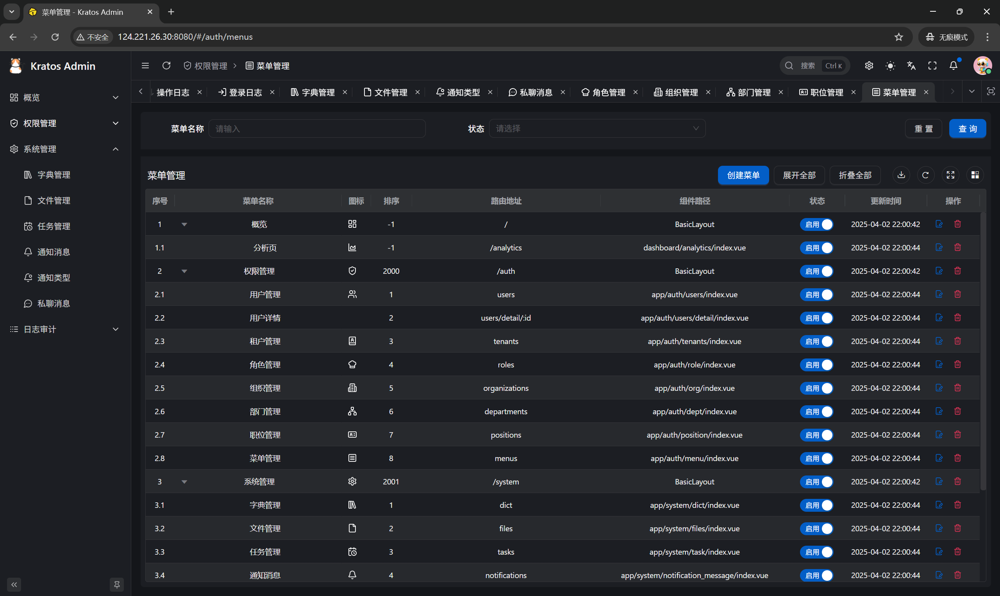
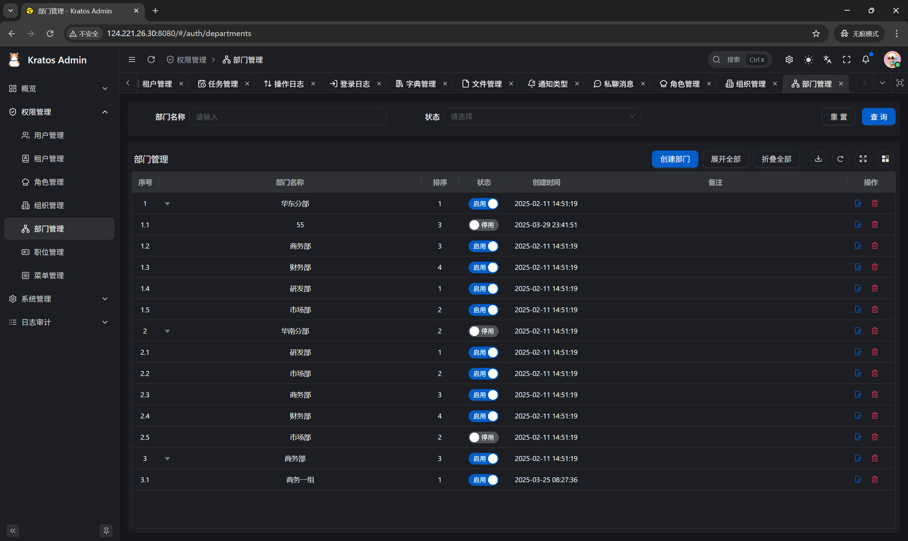
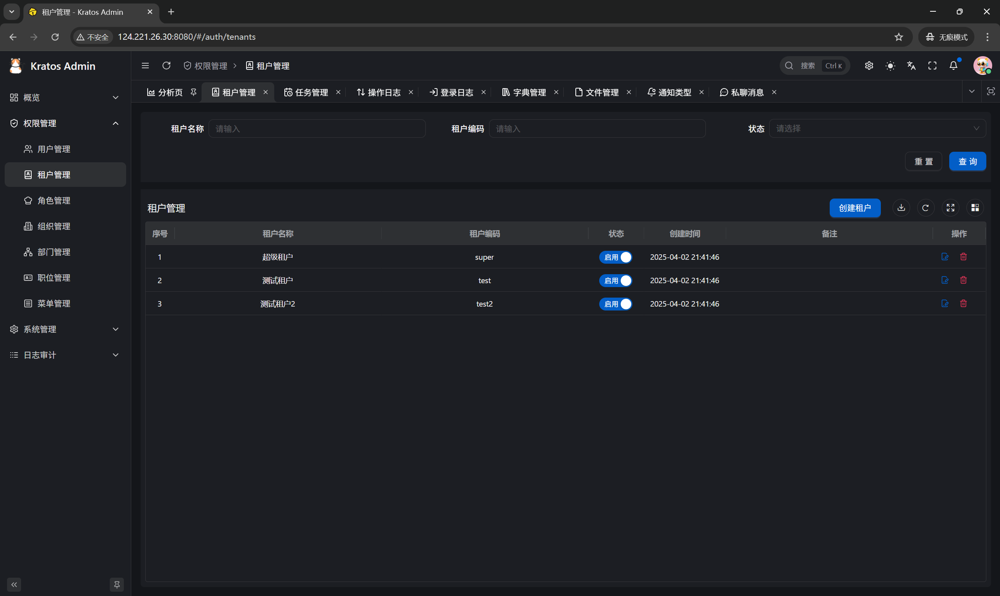
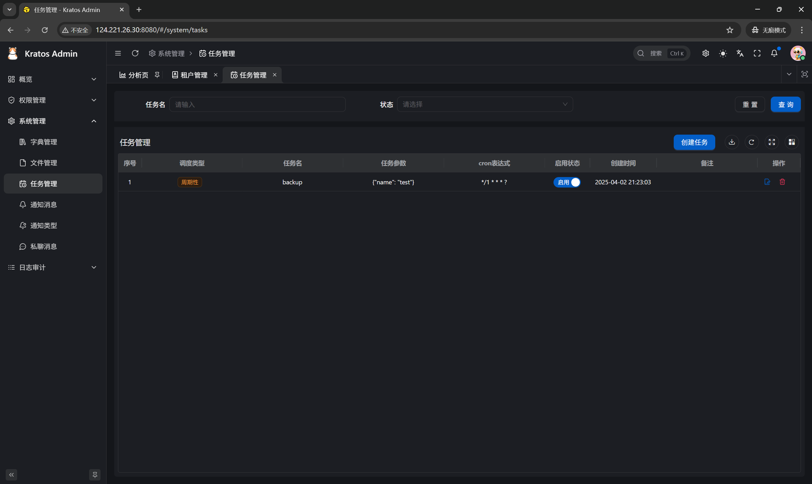
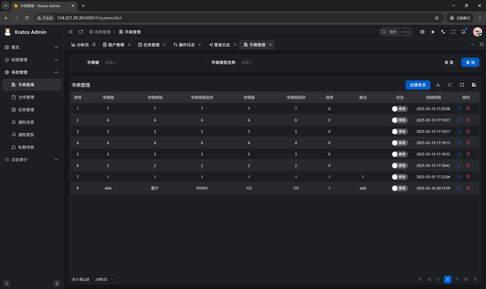

# Go Kratos Admin

Out-of-the-box Golang full-stack Admin.

The backend is based on the GO microservice framework [go-kratos](https://go-kratos.dev/), and the frontend is based on the Vue microservice framework [Vben Admin](https://doc.vben.pro/).

Although both use microservice frameworks, the frontend and backend can be developed and deployed in a monolithic architecture.

Easy to get started, feature-rich, and suitable for rapid development of enterprise-level management systems.

**English** | [中文](./README.md) | [日本語](./README.ja-JP.md)

## Demo Address

> Frontend: <http://124.221.26.30:8080/>
>
> Backend Swagger: <http://124.221.26.30:7788/docs/>
>
> Default username and password: `admin` / `admin`

## Technology Stack

- Backend: [Golang](https://go.dev/) + [go-kratos](https://go-kratos.dev/) + [wire](https://github.com/google/wire) + [ent](https://entgo.io/docs/getting-started/)
- Frontend: [Vue](https://vuejs.org/) + [TypeScript](https://www.typescriptlang.org/) + [Ant Design Vue](https://antdv.com/) + [Vben Admin](https://doc.vben.pro/)

## Quick Start Guide

1. Install Docker and Golang (refer to `backend/script/prepare_ubuntu.sh`, `backend/script/prepare_centos.sh`, `backend/script/prepare_rocky.sh`).
2. Navigate to the `backend` directory and execute the following commands to compile the backend service `kratos-admin`, build the Docker image, and start it along with the dependent Docker services:
    ```bash
    make init
    make docker
    make compose-up
    ```
3. Install npm and pnpm (installation methods can be queried from AI).
4. Navigate to the `frontend` directory and execute the following commands to compile and start the frontend (development mode):
    ```bash
    pnpm install
    pnpm dev
    ```
5. Access the test environment:

- Frontend: <http://localhost:5666>, login credentials: `admin` / `admin`
- Backend: <http://localhost:7788/docs/openapi.yaml>

## Feature List

| Feature       | Description                                                                                     |
|---------------|-------------------------------------------------------------------------------------------------|
| User Management | Manage and query users, support advanced queries and department-linked users. Users can be enabled/disabled, set/unset supervisors, reset passwords, configure multiple roles, departments, and supervisors, and log in as specific users with one click. |
| Tenant Management | Manage tenants. After adding a tenant, the tenant's department, default role, and administrator are automatically initialized. Supports package configuration, enable/disable, and one-click login to the tenant administrator. |
| Role Management | Manage roles and role groups, support user linkage by role, set menu and data permissions, and batch add/remove employees. |
| Organization Management | Manage organizations, support tree list display. |
| Department Management | Manage departments, support tree list display. |
| Permission Management | Manage permission groups, menus, and permission points. Support tree list display. |
| API Management | Manage APIs, support API synchronization for selecting APIs when adding permission points. Support tree list display and configuration of request parameters and response results in operation logs. |
| Dictionary Management | Manage data dictionary categories and their subcategories. Support dictionary category linkage, multi-column sorting on the server, and data import/export. |
| Task Scheduling | Manage and view tasks and their execution logs. Support adding, modifying, deleting, starting, pausing, and executing tasks immediately. |
| File Management | Manage file uploads. Support file queries, uploads to OSS or local storage, downloads, copying file addresses, deleting files, and viewing images in full size. |
| Message Categories | Manage message categories, support two-level custom message categories for message management. |
| Message Management | Manage messages, support sending messages to specific users, and view whether users have read the messages and the read time. |
| Inbox | Manage internal messages, support detailed message viewing, deletion, marking as read, and marking all as read. |
| Personal Center | Display and modify personal information, view last login information, change passwords, etc. |
| Cache Management | Query cache list, support clearing cache by cache key. |
| Login Logs | Query login logs, record user login success and failure logs, support IP location records. |
| Operation Logs | Query operation logs, record user operation success and failure logs, support IP location records, and view operation log details. |

## Backend Screenshots

<table>
    <tr>
        <td></td>
        <td></td>
    </tr>
    <tr>
        <td></td>
        <td></td>
    </tr>
    <tr>
        <td></td>
        <td></td>
    </tr>
    <tr>
        <td></td>
        <td></td>
    </tr>
    <tr>
        <td></td>
        <td></td>
    </tr>
    <tr>
        <td></td>
        <td></td>
    </tr>
    <tr>
        <td></td>
        <td></td>
    </tr>
    <tr>
        <td></td>
    </tr>
</table>

## Contact Us

- WeChat: `yang_lin_bo` (Note: go-kratos-admin)
- Juejin Column: [go-kratos-admin](https://juejin.cn/column/7541283508041826367)

## [Thanks to JetBrains for providing free GoLand](https://jb.gg/OpenSource)

[](https://jb.gg/OpenSource)
